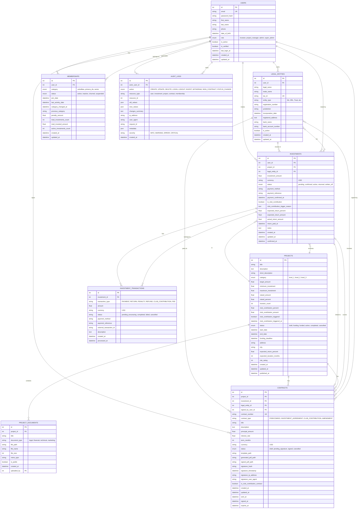

# Club ID Invest - ERD Diagram

## Entity Relationship Diagram (Mermaid)

## Business Rules Summary

### Co-Investment Tiers

| Tier | Min Raised % | Min Months | Club Contribution % |
|------|-------------|------------|---------------------|
| Cebollitas | >55% | 3 | 45% |
| 1ra Div | >65% | 6 | 35% |
| Senior | >75% | 9 | 25% |

### Membership Lifecycle

| Condition | Action |
|-----------|--------|
| 60 days inactive | Mark 'inactive', charge $50 penalty |
| 180 days inactive | Mark 'churned' |

### Constraints

- Maximum 5 active investments per user
- Maximum 50 investors per project
- Audit log retention: 7 years (2555 days)
